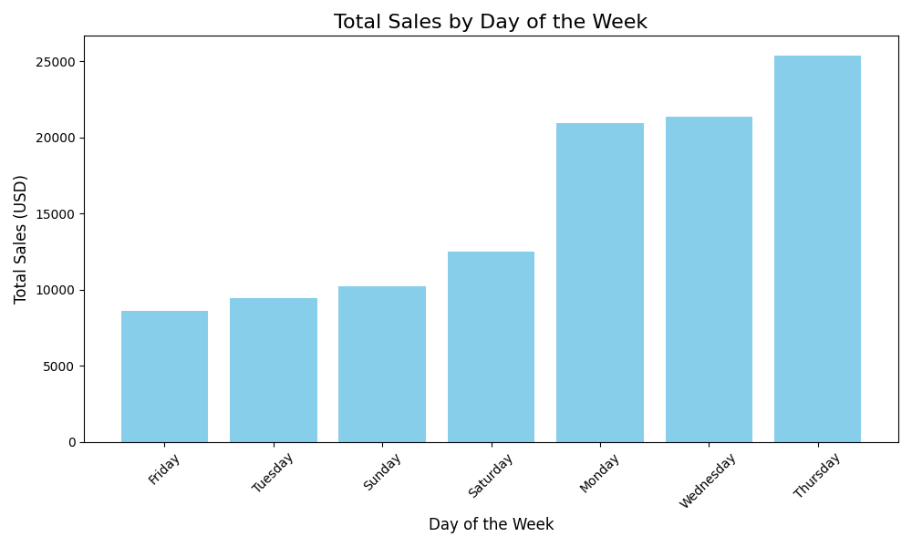
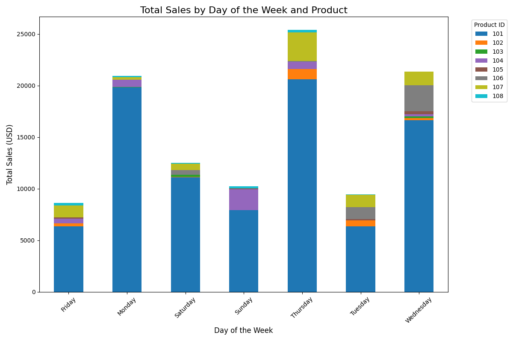
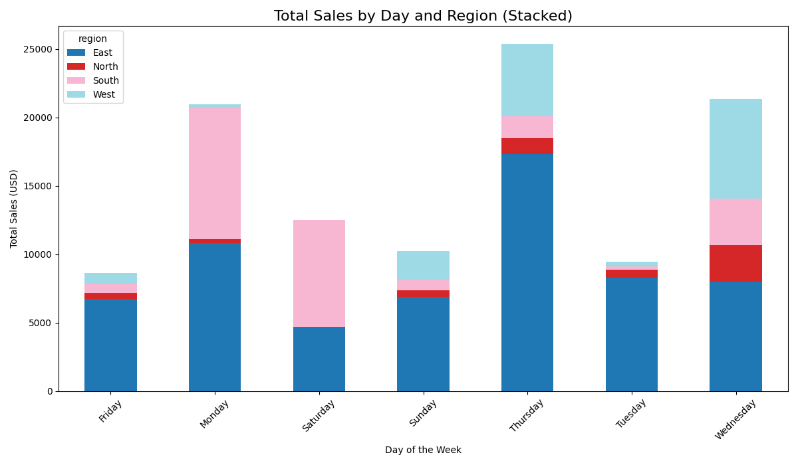
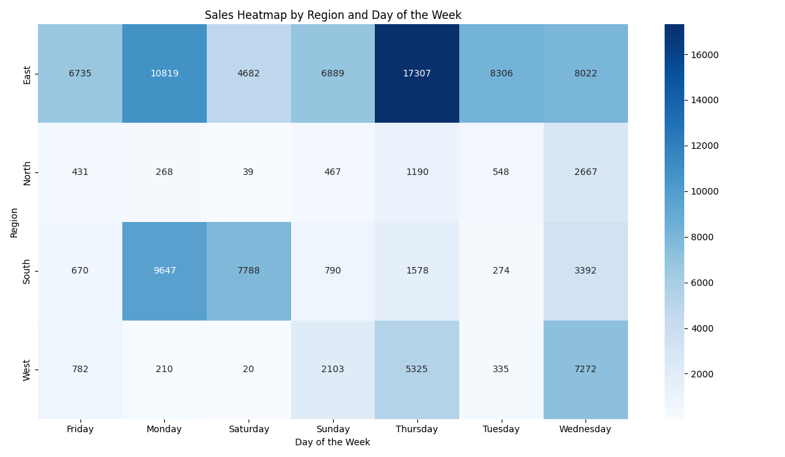

# OLAP Analysis
#### Developer: Derek Fintel
#### Contact: s542635@youremail; 555-abc-1234

### Project Intro
This README covers an overiew of a brief OLAP (Online Analytical Processing) project. 

### 1. The Business Goal

For this project we wanted to access specific tables within our 'smart_sales.db' to generate business insights pertinent to supporting potential advertising and product development strategies. 

In particular, we sought to leverage our tools to generate understandings of:
- What are the total sales per day of the week?
- What are the total sales per day PER a given region?
- What are the total sales per day of a given product?

### 2. Data Source

We used two tables from our data warehouse, "Sales" and "Customers".

From previous work we have established a data warehouse ('smart_sales.db') that has been built by intaking raw business data via CSV and performing various Python & SQL scripts that prep, scrub, and publish data. These programs were part of an ETL process that cleaned and transformed our datas, even to their table relationships and columns names. 

For our analysis, we utilized the following columns:
**cube.columns**:
[('DayOfWeek', ''), ('product_id', ''), ('customer_id', ''), ('region', ''), ('sale_amount', 'sum'), ('sale_amount', 'mean'), ('transaction_id', 'count'), ('region', 'count')]
**explicit_columns:**
['DayOfWeek', 'product_id', 'customer_id', 'region', 'sale_amount_sum', 'sale_amount_mean', 'transaction_id_count', 'transaction_id']

len(cube.columns): 8

### 3. Tools

For tools, we used a handful of critical items to execute our analysis. For major applications, we utilized **Python** to render executable code, **Power BI** for initial visualiztions, **SQLIte** for data warehouse, **VS Code** for project development, and **GitHub** for artifact management. 

See below for a list of imports:
*pandas as pd*
*sqlite3*
*pathlib*
*sys*
*matplotlib.pyplot as plt*
*seaborn as sns*

### 4. Workflow & Logic

**Codeset #1:** *olap_cubing_customer.py*

To support our investigation, we had to first retrieve and cube our desired dimensions. We started by ingesting data from both the "Sales" and "Customer" tables. We then selected specific columns for cubing (referenced above), and applide some time-based dimensions to them. Our code then wrote this compilation to our data folder via CSV. 

**Example:**

1. __main__:main:149 - Starting OLAP Cubing process...
2. __main__:ingest_sales_data_from_dw:26 - Sales data successfully loaded from SQLite data warehouse.
3. __main__:ingest_customer_data_from_dw:38 - Customer data successfully loaded from SQLite data warehouse.
4. __main__:create_olap_cube:103 - OLAP cube created with dimensions: ['DayOfWeek', 'product_id', 'customer_id', 'region']
5. __main__:write_cube_to_csv:142 - OLAP cube saved to data\olap_cubing_outputs\multidimensional_olap_cube.csv.
6. __main__:main:178 - OLAP Cubing process completed successfully.
7. __main__:main:179 - Please see outputs in data\olap_cubing_outputs

**Codeset #2:** *olap_goal_sales_by_day_and_region.py*

Our next program retrieved our newly cubed data and began performing analysis & visualizations. Our code ran multiple functions that *sorted weekday sales*, *summed sales per region*, and *identified the least profitable day*.

**Example:**

1. __main__:main:172 - Starting SALES_LOW_REVENUE_DAYOFWEEK analysis...
2. __main__:load_olap_cube:18 - OLAP cube data successfully loaded from data\olap_cubing_outputs\multidimensional_olap_cube.csv.
3. __main__:analyze_sales_by_weekday:32 - Sales aggregated by DayOfWeek successfully.
4. __main__:identify_least_profitable_day:57 - Least profitable day: Friday with revenue $8617.76.
5. __main__:main:178 - Least profitable day: Friday
6. __main__:visualize_sales_by_weekday:82 - Visualization saved to data\results\sales_by_day_of_week.png.

**Codeset #3:** *olap_goal_top_product_by_day.py*

Our last major codeset utilized a similar functional set as Codeset #2 but focused on grouping the values within our cubes and sorting them by "product_id". 

**Example:**

1. __main__:main:83 - Starting SALES_TOP_PRODUCT_BY_WEEKDAY analysis...
2. __main__:load_olap_cube:21 - OLAP cube data successfully loaded from data\olap_cubing_outputs\multidimensional_olap_cube.csv.
3. __main__:analyze_top_product_by_weekday:37 - Top products identified for each day of the week.
    DayOfWeek  product_id  TotalSales
0      Friday         101     6344.96
6      Monday         101    19828.00
11   Saturday         101    11103.68
18     Sunday         101     7931.20
22   Thursday         101    20621.12
29    Tuesday         101     6344.96
35  Wednesday         101    16655.52
| __main__:visualize_sales_by_weekday_and_product:74 - Stacked bar chart saved to data\results\sales_by_day_and_product.png.

### 5. Results

1. Present your insights with narrative and visualizations.

1. Explain any suggested actions based on the results you uncovered.

### 6. Suggested Business Action

1. What actions are recommended based on your work

### 7. Challenges

1. Mention any challenges you encountered and how they were resolved.
