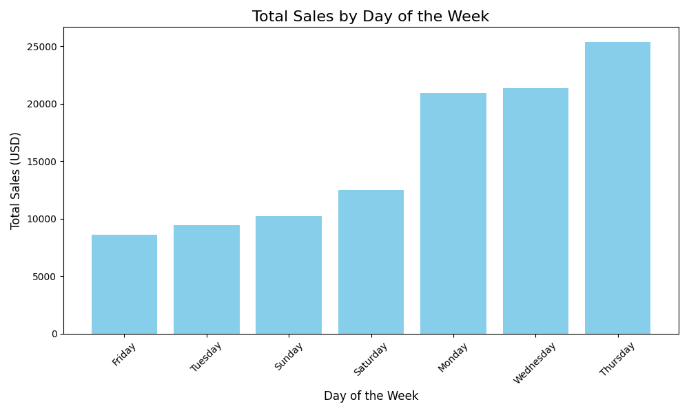
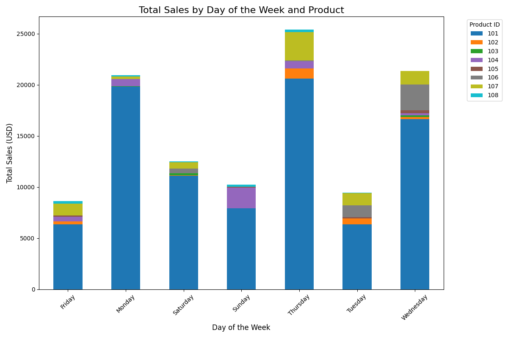
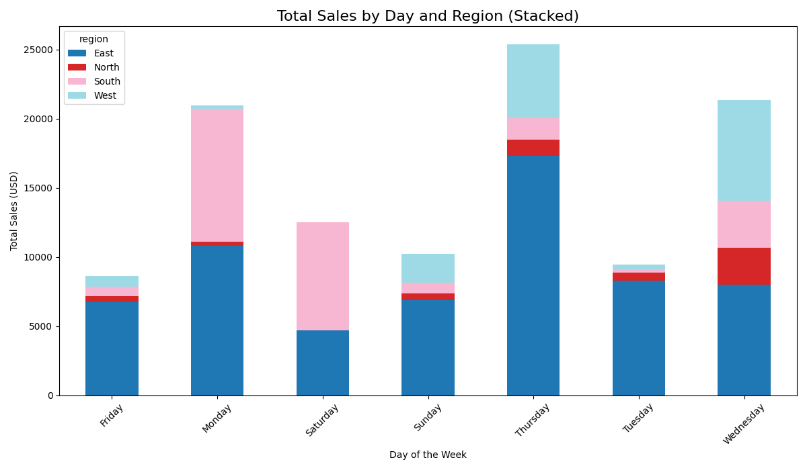
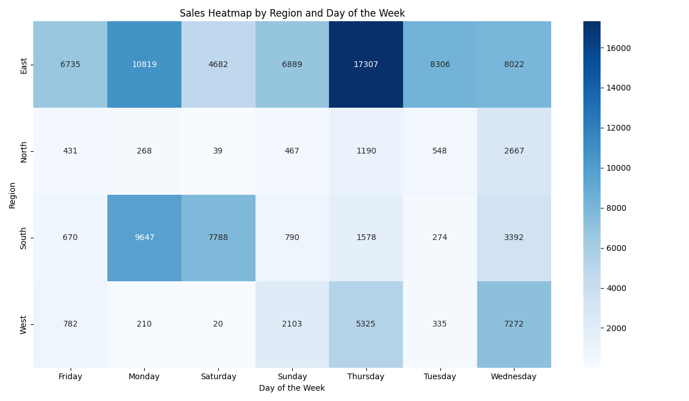

# OLAP Analysis
#### Developer: Derek Fintel
#### Contact: s542635@youremail; 555-abc-1234

### Project Intro
This README covers an overiew of a brief OLAP (Online Analytical Processing) project. 

### 1. The Business Goal

For this project we wanted to access specific tables within our 'smart_sales.db' to generate business insights pertinent to supporting potential advertising and product development strategies. 

In particular, we sought to leverage our tools to generate understandings of:
- What are the total sales per day of the week?
- What are the total sales per day PER a given region?
- What are the total sales per day of a given product?

### 2. Data Source

We used two tables from our data warehouse, "Sales" and "Customers".

From previous work we have established a data warehouse ('smart_sales.db') that has been built by intaking raw business data via CSV and performing various Python & SQL scripts that prep, scrub, and publish data. These programs were part of an ETL process that cleaned and transformed our datas, even to their table relationships and columns names. 

For our analysis, we utilized the following columns:
**cube.columns**:
[('DayOfWeek', ''), ('product_id', ''), ('customer_id', ''), ('region', ''), ('sale_amount', 'sum'), ('sale_amount', 'mean'), ('transaction_id', 'count'), ('region', 'count')]
**explicit_columns:**
['DayOfWeek', 'product_id', 'customer_id', 'region', 'sale_amount_sum', 'sale_amount_mean', 'transaction_id_count', 'transaction_id']

len(cube.columns): 8

### 3. Tools

For tools, we used a handful of critical items to execute our analysis. For major applications, we utilized **Python** to render executable code, **Power BI** for initial visualiztions, **SQLIte** for data warehouse, **VS Code** for project development, and **GitHub** for artifact management. 

See below for a list of imports:
*pandas as pd*
*sqlite3*
*pathlib*
*sys*
*matplotlib.pyplot as plt*
*seaborn as sns*

### 4. Workflow & Logic

**Codeset #1:** *olap_cubing_customer.py*

To support our investigation, we had to first retrieve and cube our desired dimensions. We started by ingesting data from both the "Sales" and "Customer" tables. We then selected specific columns for cubing (referenced above), and applide some time-based dimensions to them. Our code then wrote this compilation to our data folder via CSV. 

**Example:**

1. __main__:main:149 - Starting OLAP Cubing process...
2. __main__:ingest_sales_data_from_dw:26 - Sales data successfully loaded from SQLite data warehouse.
3. __main__:ingest_customer_data_from_dw:38 - Customer data successfully loaded from SQLite data warehouse.
4. __main__:create_olap_cube:103 - OLAP cube created with dimensions: ['DayOfWeek', 'product_id', 'customer_id', 'region']
5. __main__:write_cube_to_csv:142 - OLAP cube saved to data\olap_cubing_outputs\multidimensional_olap_cube.csv.
6. __main__:main:178 - OLAP Cubing process completed successfully.
7. __main__:main:179 - Please see outputs in data\olap_cubing_outputs

**Codeset #2:** *olap_goal_sales_by_day_and_region.py*

Our next program retrieved our newly cubed data and began performing analysis & visualizations. Our code ran multiple functions that *sorted weekday sales*, *summed sales per region*, and *identified the least profitable day*.

**Example:**

1. __main__:main:172 - Starting SALES_LOW_REVENUE_DAYOFWEEK analysis...
2. __main__:load_olap_cube:18 - OLAP cube data successfully loaded from data\olap_cubing_outputs\multidimensional_olap_cube.csv.
3. __main__:analyze_sales_by_weekday:32 - Sales aggregated by DayOfWeek successfully.
4. __main__:identify_least_profitable_day:57 - Least profitable day: Friday with revenue $8617.76.
5. __main__:main:178 - Least profitable day: Friday
6. __main__:visualize_sales_by_weekday:82 - Visualization saved to data\results\sales_by_day_of_week.png.

| __main__:load_olap_cube:24 - OLAP cube data successfully loaded from data\olap_cubing_outputs\multidimensional_olap_cube.csv.
| __main__:analyze_sales_by_weekday:38 - Sales aggregated by DayOfWeek successfully.
| __main__:analyze_sales_by_day_and_region:53 - Sales aggregated by DayOfWeek and Region successfully.
| __main__:analyze_sales_by_region_and_month:90 - Sales by region and month successfully aggregated.
| __main__:analyze_sales_by_category_and_month:128 - Sales by category and month successfully aggregated.
| __main__:identify_least_profitable_day:138 - Least profitable day: Friday with revenue $8617.76.
| __main__:main:465 - Least profitable weekday identified: Friday
| __main__:visualize_sales_by_weekday:226 - Visualization with trendline saved to data\results\sales_by_day_of_week_with_trendline.png.      
| __main__:visualize_sales_by_day_and_region:300 - Stacked region-by-day chart saved to data\results\sales_by_day_and_region_stacked.png.    
| __main__:visualize_region_heatmap:322 - Heatmap saved to data\results\sales_heatmap_by_region_and_day.png.
| __main__:visualize_sales_by_region_and_month:188 - Sales by region over months chart saved to data\results\sales_by_region_over_months.png.
| __main__:visualize_sales_by_category_and_month:279 - Category-over-months scatterplot saved to data\results\sales_by_category_over_months_scatter.png.
| __main__:visualize_all_categories_sales_by_region_and_month:355 - Faceted category-region-month sales chart saved to data\results\category_sales_by_region_month_facet.png.
| __main__:main:480 - Generating visualizations for category: Clothing
| __main__:analyze_sales_by_category_and_region:68 - Sales by region for category 'Clothing' successfully aggregated.
| __main__:analyze_category_sales_by_region_and_month:109 - Monthly sales for category 'Clothing' by region successfully aggregated.
c:\Projects\smart-store-derekfintel\P7_CustomBI\olap_goal_sales_by_day_and_region.py:149: FutureWarning:

Passing `palette` without assigning `hue` is deprecated and will be removed in v0.14.0. Assign the `x` variable to `hue` and set `legend=False` for the same effect.

  sns.barplot(
| __main__:visualize_category_sales_by_region:163 - Category-by-region chart saved to data\results\sales_by_region_for_category_Clothing.png.
| __main__:visualize_category_sales_by_region_and_month:246 - Category sales trend chart by region and month saved to data\results\category_sales_by_region_monthly_Clothing.png.
| __main__:visualize_category_sales_stacked_area:377 - Stacked area chart saved to data\results\category_sales_stacked_area_Clothing.png.    
2025-04-22 20:09:03.111 | INFO     | __main__:visualize_category_region_month_heatmap:408 - Heatmap saved to data\results\category_region_month_heatmap_Clothing.png.
2025-04-22 20:09:04.066 | INFO     | __main__:main:480 - Generating visualizations for category: Sports
2025-04-22 20:09:04.072 | INFO     | __main__:analyze_sales_by_category_and_region:68 - Sales by region for category 'Sports' successfully aggregated.
2025-04-22 20:09:04.079 | INFO     | __main__:analyze_category_sales_by_region_and_month:109 - Monthly sales for category 'Sports' by region successfully aggregated.
c:\Projects\smart-store-derekfintel\P7_CustomBI\olap_goal_sales_by_day_and_region.py:149: FutureWarning:

Passing `palette` without assigning `hue` is deprecated and will be removed in v0.14.0. Assign the `x` variable to `hue` and set `legend=False` for the same effect.

  sns.barplot(
2025-04-22 20:09:04.311 | INFO     | __main__:visualize_category_sales_by_region:163 - Category-by-region chart saved to data\results\sales_by_region_for_category_Sports.png.  
2025-04-22 20:09:05.795 | INFO     | __main__:visualize_category_sales_by_region_and_month:246 - Category sales trend chart by region and month saved to data\results\category_sales_by_region_monthly_Sports.png.
2025-04-22 20:09:07.207 | INFO     | __main__:visualize_category_sales_stacked_area:377 - Stacked area chart saved to data\results\category_sales_stacked_area_Sports.png.      
2025-04-22 20:09:08.727 | INFO     | __main__:visualize_category_region_month_heatmap:408 - Heatmap saved to data\results\category_region_month_heatmap_Sports.png.
2025-04-22 20:09:10.505 | INFO     | __main__:main:480 - Generating visualizations for category: Electronics
2025-04-22 20:09:10.522 | INFO     | __main__:analyze_sales_by_category_and_region:68 - Sales by region for category 'Electronics' successfully aggregated.
2025-04-22 20:09:10.530 | INFO     | __main__:analyze_category_sales_by_region_and_month:109 - Monthly sales for category 'Electronics' by region successfully aggregated.      
c:\Projects\smart-store-derekfintel\P7_CustomBI\olap_goal_sales_by_day_and_region.py:149: FutureWarning:

Passing `palette` without assigning `hue` is deprecated and will be removed in v0.14.0. Assign the `x` variable to `hue` and set `legend=False` for the same effect.

  sns.barplot(
2025-04-22 20:09:10.730 | INFO     | __main__:visualize_category_sales_by_region:163 - Category-by-region chart saved to data\results\sales_by_region_for_category_Electronics.png.
2025-04-22 20:09:12.221 | INFO     | __main__:visualize_category_sales_by_region_and_month:246 - Category sales trend chart by region and month saved to data\results\category_sales_by_region_monthly_Electronics.png.
2025-04-22 20:09:13.983 | INFO     | __main__:visualize_category_sales_stacked_area:377 - Stacked area chart saved to data\results\category_sales_stacked_area_Electronics.png. 
2025-04-22 20:09:15.533 | INFO     | __main__:visualize_category_region_month_heatmap:408 - Heatmap saved to data\results\category_region_month_heatmap_Electronics.png.        
2025-04-22 20:09:16.298 | INFO     | __main__:main:489 - All analyses and visualizations completed successfully.

**Codeset #3:** *olap_goal_top_product_by_day.py*

Our last major codeset utilized a similar functional set as Codeset #2 but focused on grouping the values within our cubes and sorting them by "product_id". 

**Example:**

1. __main__:main:83 - Starting SALES_TOP_PRODUCT_BY_WEEKDAY analysis...
2. __main__:load_olap_cube:21 - OLAP cube data successfully loaded from data\olap_cubing_outputs\multidimensional_olap_cube.csv.
3. __main__:analyze_top_product_by_weekday:37 - Top products identified for each day of the week.
    DayOfWeek  product_id  TotalSales
0      Friday         101     6344.96
6      Monday         101    19828.00
11   Saturday         101    11103.68
18     Sunday         101     7931.20
22   Thursday         101    20621.12
29    Tuesday         101     6344.96
35  Wednesday         101    16655.52
| __main__:visualize_sales_by_weekday_and_product:74 - Stacked bar chart saved to data\results\sales_by_day_and_product.png.

### 5. Results

For our results, will walk through our summary findings and detail insights rendered from our visualizations. 

First, we find that Mondays, Wednesdays, and Thursdays have the strongest sales per week. 

Next, we see that Product "101" has consistent and substantial sales to that of others. Products "104" and "107" trail but are still significantly less than "101".

Our region analysis provided some interesting observations where "East" was consistently strong followed by "South", "West", and "North" with the least. 

Our last visual gives a heatmap of sales per region and day of the week. It provides a nice summary view where we see that sales are highest in our "East" region on Thursday's and seconded by "South" on Monday's.

### 6. Suggested Business Action

**BLUF:** To sustain growth and increase competitive reach, I suggest a series of quick analyses and activities to support further product development & advertisement criteria. 

1) All products should be analyzed for profit ratio and investigated for: 
   1) What is an acceptable discount to run?
   2) What are it's competitive brands and options?
   
2) Advertising analysis should be done across the product types to understand customer demographics and shopping platforms.
    1) Where are customers purchasing our products from?
    2) What advertisements are currently being ran and their costs?

3) Following the advertisement analysis, that data should be complimented with investigating the demographic trends per customer region. 

4) Once these data pillars are established, the company should commission the development of Machine Learning functions to perform predictive analytics of the criteria above, over given out-years and fiscal quarters. 

5) Lastly, the team developing these constructs should be tasked with finalizing their product in a web-based dashboard  where stakeholders are given convenient access and can query their own strategic interests. 

### 7. Challenges

Overall, this project went fairly smoothly. I needed to adjsut some of my column names and add additional functions to reference multiple tables in the data warehouse but otherwise everything worked without a hitch. 

Thank you for taking the time to review this project. Should you have any questions, collaborative interests, or inquiries, please connect with me.

Cheers,

-Derek Fintel
