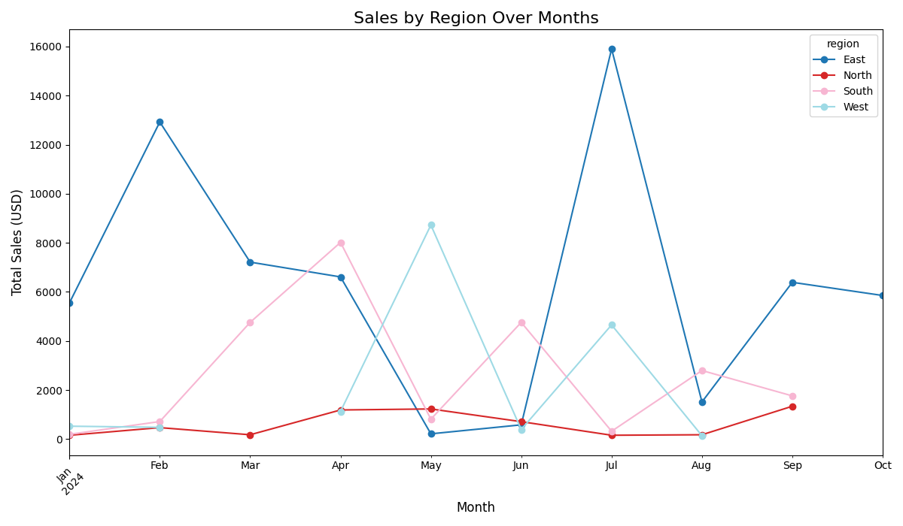
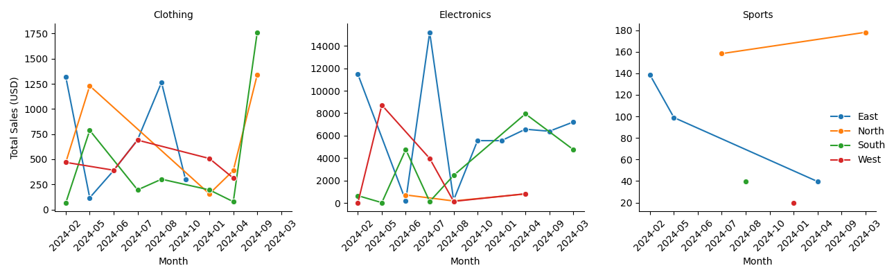
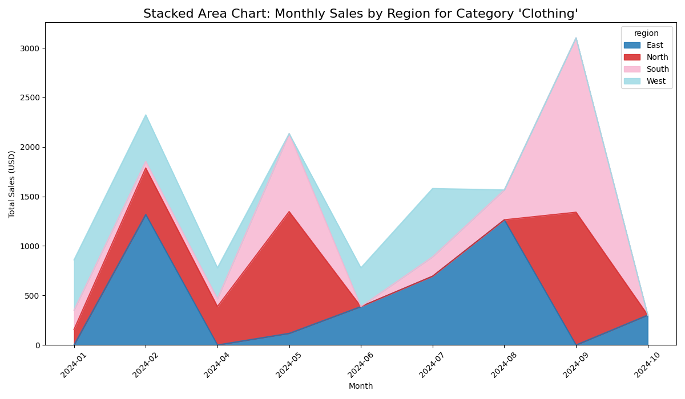
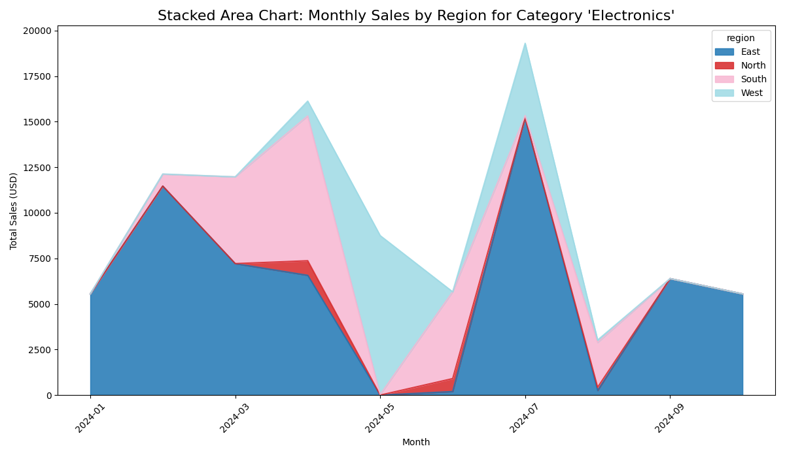
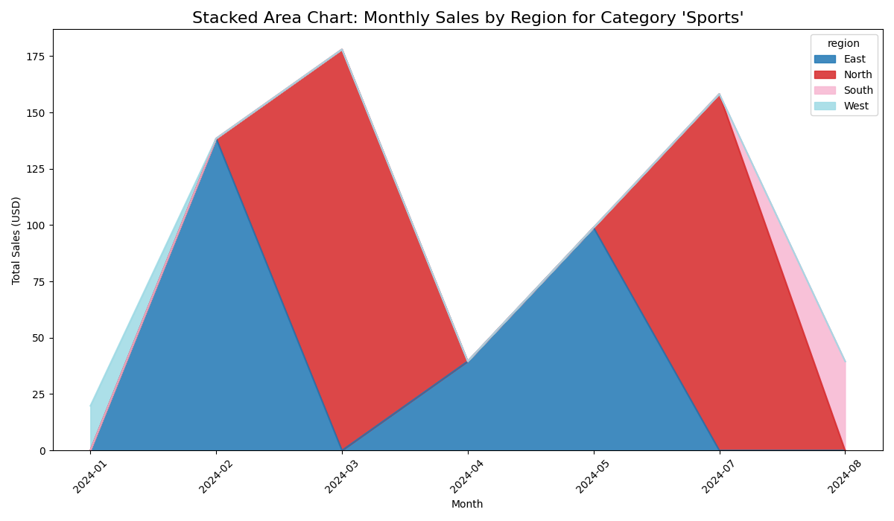
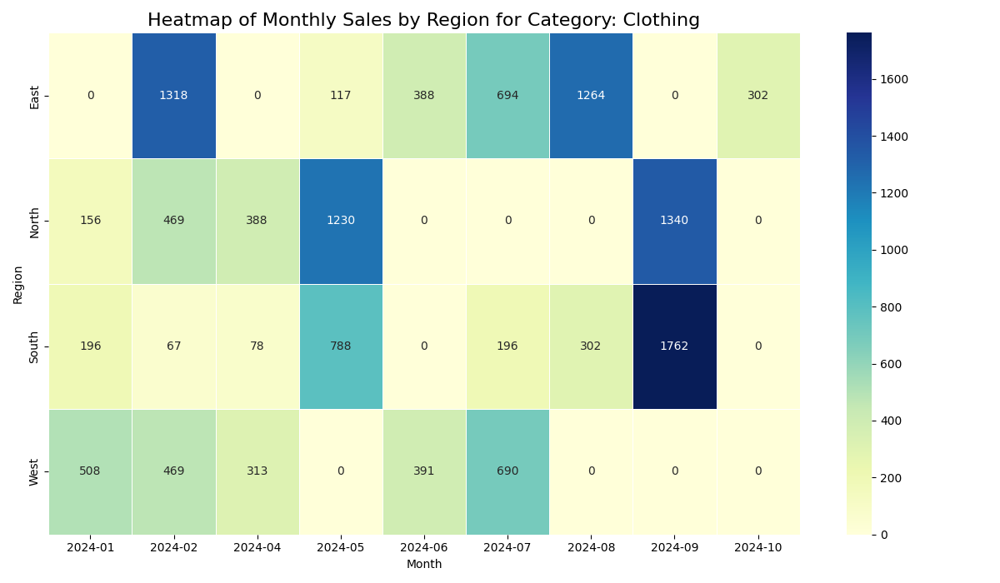
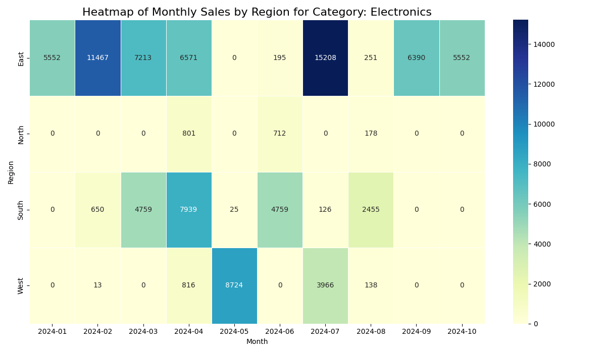
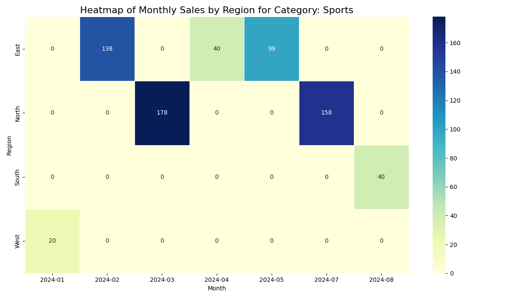

# P7 Custom BI Project
#### Developer: Derek Fintel
#### Contact: s542635@youremail; 555-abc-1234
#### Date: 04/22/2025

### Project Intro
This README covers an overiew of our final P7 Custom Business Intelligence project.

### 1. The Business Goal

For this project we wanted to access specific tables within our 'smart_sales.db' to generate business insights pertinent to supporting potential advertising and product development strategies. 

In this project, we primarily wanted to:
- Understand the correlations and trends of product types and their sales in respective regions. 
  
Previous analyses leveraged in our code:
- What are the total sales per day of the week?
- What are the total sales per day PER a given region?
- What are the total sales per day of a given product?

### 2. Data Source

We used all available tables from our data warehouse, "Sales", "Product", and "Customers".

From previous work we have established a data warehouse ('smart_sales.db') that has been built by intaking raw business data via CSV and performing various Python & SQL scripts that prep, scrub, and publish data. These programs were part of an ETL process that cleaned and transformed our datas, even to their table relationships and columns names. 

For our analysis, we utilized the following columns:
**cube.columns**:
[('DayOfWeek', ''), ('product_id', ''), ('customer_id', ''), ('region', ''), ('sale_amount', 'sum'), ('sale_amount', 'mean'), ('transaction_id', 'count'), ('region', 'count')]
**explicit_columns:**
['DayOfWeek', 'product_id', 'customer_id', 'region', 'sale_amount_sum', 'sale_amount_mean', 'transaction_id_count', 'transaction_id']

len(cube.columns): 8

### 3. Tools

For tools, we used a handful of critical items to execute our analysis. For major applications, we utilized **Python** to render executable code, **Power BI** for initial visualiztions, **SQLIte** for data warehouse, **VS Code** for project development, and **GitHub** for artifact management. 

See below for a list of imports:
*pandas as pd*
*sqlite3*
*pathlib*
*sys*
*matplotlib.pyplot as plt*
*seaborn as sns*

### 4. Workflow & Logic

**Codeset #1:** *olap_cubing_customer.py*

To support our investigation, we had to first retrieve and cube our desired dimensions. We started by ingesting data from the "Sales", "Product", and "Customer" tables. We then selected specific columns for cubing (referenced above), and applide some time-based dimensions to them. Our code then wrote this compilation to our data folder via CSV.

**CSV:** C:\Projects\smart-store-derekfintel\data\olap_cubing_outputs\multidimensional_olap_cube.csv

**Example:**

1. __main__:main:149 - Starting OLAP Cubing process...
2. __main__:ingest_sales_data_from_dw:26 - Sales data successfully loaded from SQLite data warehouse.
3. __main__:ingest_customer_data_from_dw:38 - Customer data successfully loaded from SQLite data warehouse.
4. __main__:create_olap_cube:103 - OLAP cube created with dimensions: ['DayOfWeek', 'product_id', 'customer_id', 'region']
5. __main__:write_cube_to_csv:142 - OLAP cube saved to data\olap_cubing_outputs\multidimensional_olap_cube.csv.
6. __main__:main:178 - OLAP Cubing process completed successfully.
7. __main__:main:179 - Please see outputs in data\olap_cubing_outputs

**Codeset #2:** *olap_goal_sales_by_day_and_region.py*

Our next program retrieved our newly cubed data and began performing analysis & visualizations. Our code ran multiple functions that *sorted weekday sales*, *summed sales per region*, and *identified the least profitable day*.

**Example:**

1. __main__:main:172 - Starting SALES_LOW_REVENUE_DAYOFWEEK analysis...
2. __main__:load_olap_cube:18 - OLAP cube data successfully loaded from data\olap_cubing_outputs\multidimensional_olap_cube.csv.
3. __main__:visualize_sales_by_day_and_region:300 - Stacked region-by-day chart saved to data\results\sales_by_day_and_region_stacked.png.
4. __main__:visualize_sales_by_category_and_month:279 - Category-over-months scatterplot saved to data\results\sales_by_category_over_months_scatter.png.
5. __main__:visualize_all_categories_sales_by_region_and_month:355 - Faceted category-region-month sales chart saved to data\results\category_sales_by_region_month_facet.png.
6. __main__:analyze_sales_by_category_and_region:68 - Sales by region for category 'Clothing' successfully aggregated.
7. __main__:visualize_category_sales_by_region:163 - Category-by-region chart saved to data\results\sales_by_region_for_category_Clothing.png.
8. __main__:analyze_sales_by_category_and_region:68 - Sales by region for category 'Sports' successfully aggregated.
9. __main__:visualize_category_sales_by_region:163 - Category-by-region chart saved to data\results\sales_by_region_for_category_Sports.png.

### 5. Results

In this section, we will outline a series of visualizations that summarize our correlations and trends identified. 

First we see a line chart of the categorical sales over the given months in our data. Immediate obserations are that our "North" region has the lowest 'Total Sales' and the "East" region has the highest. 

Next, we take the same constructs of 'Total Sales' per 'Month' rendered individually per each category, "Clothing", "Elecrtonics", & "Sports". We find that "Clothing" & "Electronics" are consistently popular categories with "Sports" providing the least amount of sales. 

The next stacked area charts provide category specific analysis:

Our last segment of visualizations provides a monthly heatmap view of sales of a given category per region:

### 6. Suggested Business Action

**BLUF:** To sustain growth and increase competitive reach, I suggest a series of quick analyses and activities to support further product development & advertisement criteria. 

1) All products should be analyzed for profit ratio and investigated for: 
   1) What is an acceptable discount to run?
   2) What are it's competitive brands and options?
   
2) Advertising analysis should be done across the product types to understand customer demographics and shopping platforms.
    1) Where are customers purchasing our products from?
    2) What advertisements are currently being ran and their costs?

3) Following the advertisement analysis, that data should be complimented with investigating the demographic trends per customer region. 

4) Once these data pillars are established, the company should commission the development of Machine Learning functions to perform predictive analytics of the criteria above, over given out-years and fiscal quarters. 

5) Lastly, the team developing these constructs should be tasked with finalizing their product in a web-based dashboard  where stakeholders are given convenient access and can query their own strategic interests. 

### 7. Challenges

Overall, this project went fairly smoothly. I needed to adjsut some of my column names and add additional functions to reference multiple tables in the data warehouse but otherwise everything worked without a hitch. 

Thank you for taking the time to review this project. Should you have any questions, collaborative interests, or inquiries, please connect with me.

Cheers,

-Derek Fintel

### Ethical Considerations
