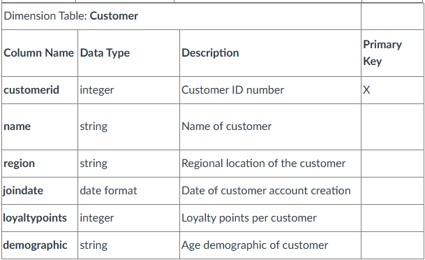
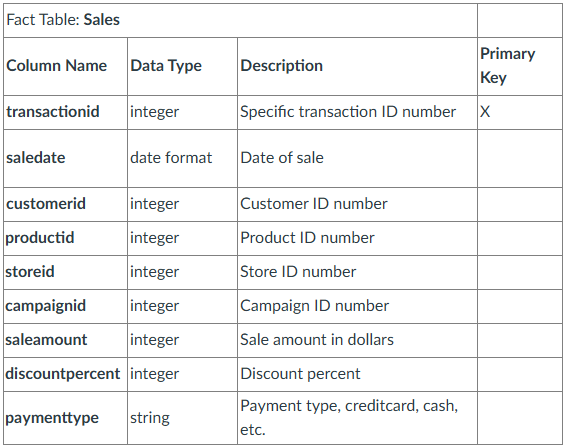

# smart-store-derekfintel

### Steps
```
1. Click "New Repository"
    a. Generate name with no spaces
    b. Add a "README.md"
2. Clone Repository to machine via VS Code
    a. Create folder in "C:\Projects"
3. Install requirements.txt
4. Setup gitignore
5. Test example scripts in .venv
```
### Create Project Virtual Environment
```
py -m venv .venv
.venv\Scripts\Activate
py -m pip install --upgrade pip 
py -m pip install -r requirements.txt
```
### Git add, clone, and commit
```
git add .
git clone "urlexample.git"
git commit -m "add .gitignore, cmds to readme"
git push -u origin main
```
### If copying a repository:
```
1. Click "Use this template" on this example repository (if it's not a template, click "Fork" instead).
2. Clone the repository to your machine:
   git clone example-repo-url
3. Open your new cloned repository in VS Code.
```
### Product Table Schema


### Customer Table Schema


### Sales Table Schema
