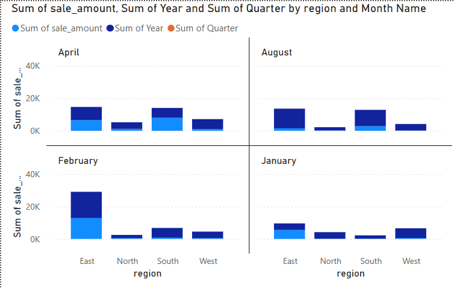
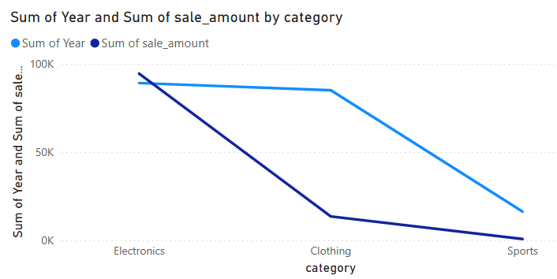

# smart-store-derekfintel
#### Developer: Derek Fintel
#### Contact: s542635@youremail; 555-abc-1234

### Project Intro
This project designs and implements a data warehouse structure that optimizes data retrieval and scalability. This involves creating a well-organized database using concepts like dimensional modeling and implementing it in a way that supports both current and future needs. The design process ensures that data from various sources is consolidated into a unified format that is easy to query and analyze.

### Preliminary Setup Steps
### 1. Initialize
```
1. Click "New Repository"
    a. Generate name with no spaces
    b. Add a "README.md"
2. Clone Repository to machine via VS Code
    a. Create folder in "C:\Projects"
3. Install requirements.txt
4. Setup gitignore
5. Test example scripts in .venv
```
### 2. Create Project Virtual Environment
```
py -m venv .venv
.venv\Scripts\Activate
py -m pip install --upgrade pip 
py -m pip install -r requirements.txt
```
### 3. Git add, clone, and commit
```
git add .
git clone "urlexample.git"
git commit -m "add .gitignore, cmds to readme"
git push -u origin main
```
### 4. If copying a repository:
```
1. Click "Use this template" on this example repository (if it's not a template, click "Fork" instead).
2. Clone the repository to your machine:
   git clone example-repo-url
3. Open your new cloned repository in VS Code.
```
### Below are the schemas for our tables used
### Product Table Schema


### Customer Table Schema


### Sales Table Schema


### Power BI & SQLite3 
```
Within Power BI, we established a DNS connection to our smart_sales.db via ODBC connector.
-ODBC connector; Windows x64.exe: https://www.ch-werner.de/sqliteodbc

Once our Power BI was connected, we established a query via Power Query Editor to capture total_sales:
= Value.NativeQuery(Source, "
        SELECT c.name, SUM(s.sale_amount) AS total_spent
        FROM sale s
        JOIN customer c ON s.customer_id = c.customer_id
        GROUP BY c.name
        ORDER BY total_spent DESC;
    ")

Here are some snips of the outcome:

1) Power BI Model Views / Spark SQL Schema






!


